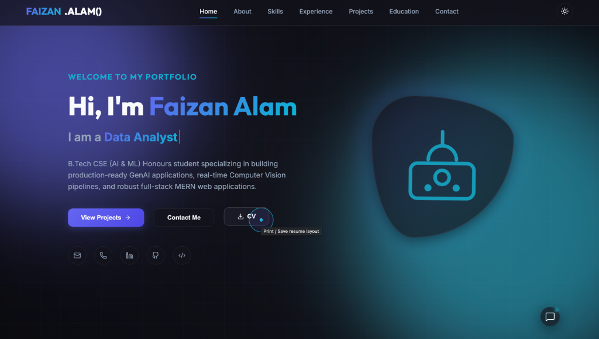
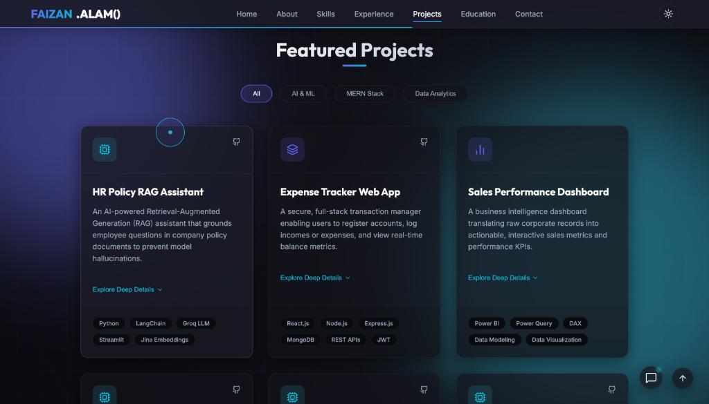
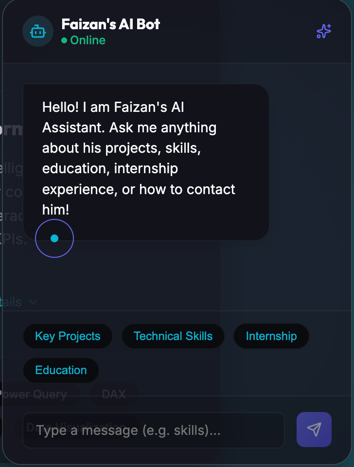

<<<<<<< HEAD
# Faizan Alam's Portfolio Website

A modern, responsive developer portfolio for **Faizan Alam**, an AI/ML engineer, MERN stack developer, and data analyst. The site presents Faizan's background, technical skills, experience, education, certifications, and featured projects through a polished single-page experience.

[](https://my-portfolio-website-beige-iota.vercel.app)
[](https://react.dev/)
[](https://vite.dev/)
[](https://developer.mozilla.org/en-US/docs/Web/JavaScript)

## Overview

This portfolio is designed to make it easy for recruiters, collaborators, and visitors to understand Faizan's work quickly. It combines a dark, gradient-driven visual system with interactive project exploration and a built-in assistant that answers common questions about the portfolio.

## Features

- Responsive single-page portfolio layout
- Hero section with animated role text for AIML Engineer, MERN Stack Developer, and Data Analyst
- Smooth navigation across About, Skills, Experience, Projects, Education, and Contact sections
- Featured projects with category filters for AI & ML, MERN Stack, and Data Analytics
- Expandable project cards with features, architecture decisions, challenges, and solutions
- Client-side AI Portfolio Assistant with quick prompts for projects, skills, internship, and education
- Resume download generated directly in Markdown format
- Contact form and social profile links
- Scroll reveal animations, custom cursor styling, dark visual theme, and responsive layouts
- Reusable React components and centralized portfolio/resume data

## Screenshots

### Home


### AI Portfolio Assistant


### Featured Projects


## Tech Stack

- **Frontend:** React, React DOM, JavaScript (ES modules)
- **Build tool:** Vite
- **Icons:** Lucide React
- **Styling:** CSS3 with reusable global and component styles
- **Code quality:** Oxlint
- **Deployment:** Vercel

## Featured Projects

The portfolio currently highlights projects across three categories:

| Project | Category | Technologies |
| --- | --- | --- |
| HR Policy RAG Assistant | AI & ML | Python, LangChain, Groq LLM, Streamlit, Jina Embeddings |
| Expense Tracker Web App | MERN Stack | React, Node.js, Express.js, MongoDB, REST APIs, JWT |
| Sales Performance Dashboard | Data Analytics | Power BI, Power Query, DAX, Data Modeling |
| AI Expense Categorizer & Forecaster | AI & ML | Python, Scikit-learn, Pandas, OCR, Matplotlib |
| Driver Drowsiness Detector | AI & ML | Python, OpenCV, MediaPipe, Computer Vision |
| Hand Gesture Web Controller | AI & ML | Python, MediaPipe, JavaScript, WebSockets |
| PDF to Audiobook Converter | MERN Stack | Python, pyttsx3, gTTS, PDF Parsing |

## Getting Started

### Prerequisites

Use a current Node.js LTS release and npm.

### Installation

```bash
git clone https://github.com/faizanalam-1457/My-Portfolio-Website.git
cd My-Portfolio-Website
npm install
```

### Run locally

```bash
npm run dev
```

Open the local URL shown by Vite in your browser.

### Available scripts

| Command | Description |
| --- | --- |
| `npm run dev` | Start the Vite development server |
| `npm run build` | Create a production build |
| `npm run preview` | Preview the production build locally |
| `npm run lint` | Run Oxlint |

## Project Structure

```text
.
├── public/                  # Static assets and SVG icons
├── src/
│   ├── assets/              # Portfolio imagery
│   ├── components/          # Page sections and reusable UI components
│   ├── hooks/               # Custom React hooks
│   ├── styles/              # Global and component-level CSS
│   ├── utils/               # Centralized resume and chatbot data
│   ├── App.jsx              # Application shell
│   └── main.jsx             # React entry point
├── index.html
├── package.json
└── vite.config.js
```

## Customization

Update `src/utils/resumeData.js` to change profile details, skills, experience, education, certifications, project answers, and chatbot responses. Project cards and categories can be updated in `src/components/Projects.jsx`.

## Deployment

The project is configured as a Vite application and can be deployed to Vercel or any static hosting provider that supports SPA fallback routing.

For Vercel:

1. Import the repository.
2. Keep the default Vite build settings.
3. Deploy the project.

## Contact

- **Email:** [faizanalam1457@gmail.com](mailto:faizanalam1457@gmail.com)
- **LinkedIn:** [linkedin.com/in/faiz-alam-858a5630a](https://linkedin.com/in/faiz-alam-858a5630a)
- **GitHub:** [github.com/faizanalam-1457](https://github.com/faizanalam-1457)
- **LeetCode:** [leetcode.com/u/faizanalam1457](https://leetcode.com/u/faizanalam1457)

## License

No license has been specified for this repository yet. Add a license file if you plan to make the project open source for reuse.
=======
# 🚀 Faizan Alam | Portfolio Website & AI Assistant

Welcome to my personal portfolio repository! This is a modern, premium, and fully responsive portfolio web application showcasing my projects, skills, education, and internship experience. It also features a custom-built, interactive client-side AI Chatbot to guide visitors through my details.

---

## 📸 Screenshots

### 🏠 Home Page
A sleek, modern dark-themed hero landing page introducing my background, education, and links to projects, contact info, and CV download.


### 💻 Featured Projects
An interactive workspace displaying categories like AI & ML, MERN Stack, and Data Analytics. Each project card contains high-level tech stacks, key features, architecture justifications, and challenges solved.


### 🤖 Faizan's AI Bot
An interactive, client-side AI assistant designed to answer queries about my key projects, technical skills, internship experiences, education, and contact details with preset suggestion triggers.


---

## 🛠️ Tech Stack & Key Features

- **Frontend**: React.js, Vite, Vanilla CSS
- **Icons**: Lucide React & Phosphor Icons
- **Responsiveness**: Mobile-first grid & flex layouts
- **Theme**: Premium dark mode design with glassmorphic aesthetics
- **Interactive AI Chatbot**: Built-in client-side smart keyword matching bot for instant interactive resumes

---

## 🚀 Getting Started

### Prerequisites
Make sure you have [Node.js](https://nodejs.org/) installed.

### Installation
1. Clone the repository:
   ```bash
   git clone https://github.com/faizanalam-1457/faizan-portfolio.git
   cd faizan-portfolio
   ```

2. Install dependencies:
   ```bash
   npm install
   ```

3. Run the development server:
   ```bash
   npm run dev
   ```

4. Build the application for production:
   ```bash
   npm run build
   ```

---

## 📁 Project Structure

```text
├── public/
│   ├── screenshots/      # Screenshots for README showcase
│   ├── favicon.svg       # Website favicon
│   └── icons.svg         # SVG Icons
├── src/
│   ├── assets/           # Project static assets
│   ├── components/       # Reusable UI components (Hero, Projects, Chatbot, etc.)
│   ├── hooks/            # Custom React hooks (scroll animations)
│   ├── styles/           # CSS design systems (global, component level styles)
│   ├── utils/            # Data models and constants (resume data)
│   ├── App.jsx           # Main application shell
│   └── main.jsx          # Entry point
├── package.json          # Node dependencies and scripts
└── vite.config.js        # Vite compiler configuration
```

---

## 📬 Contact Info
- **Email**: [faizanalam1457@gmail.com](mailto:faizanalam1457@gmail.com)
- **LinkedIn**: [Faizan Alam](https://linkedin.com/in/faizan-alam-858a5630a)
- **GitHub**: [@faizanalam-1457](https://github.com/faizanalam-1457)
>>>>>>> be75244 (Update portfolio hero section)
